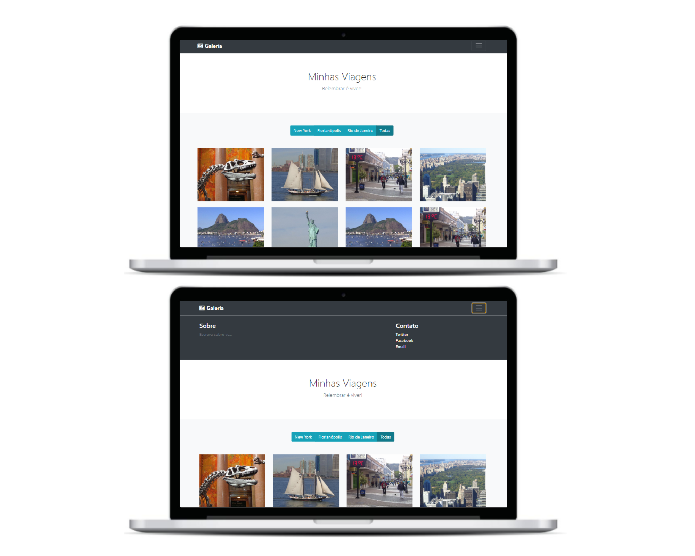

# Gallery

## Descrição

Este projeto consiste na criação de uma galeria de fotos utilizando o framework Bootstrap. A aplicação permite filtrar as fotos de três cidades diferentes: Nova York, Florianópolis e Rio de Janeiro. Para isso, basta clicar no botão correspondente a cada cidade ou no botão "Todas" para exibir todas as fotos.

## Tecnologias Utilizadas

- HTML
- SCSS
- JavaScript
- Bootstrap

## Como Executar

Para iniciar o projeto, siga as etapas abaixo:

1. Certifique-se de ter o Node.js instalado em seu computador.
2. Clone o repositório para o seu computador.
3. Abra o terminal e navegue até a pasta do projeto.
4. Execute o seguinte comando 'npm i' para instalar as dependências do projeto.
5. Após a conclusão da instalação, execute o comando 'npm start' para iniciar o projeto.

## Funcionalidades

- Filtragem das fotos por cidade, através dos botões de seleção.
- Exibição das fotos de acordo com a cidade selecionada.

## Contribuindo

Se você deseja contribuir com este projeto, por favor, faça um fork do repositório e envie um pull request com suas alterações.

